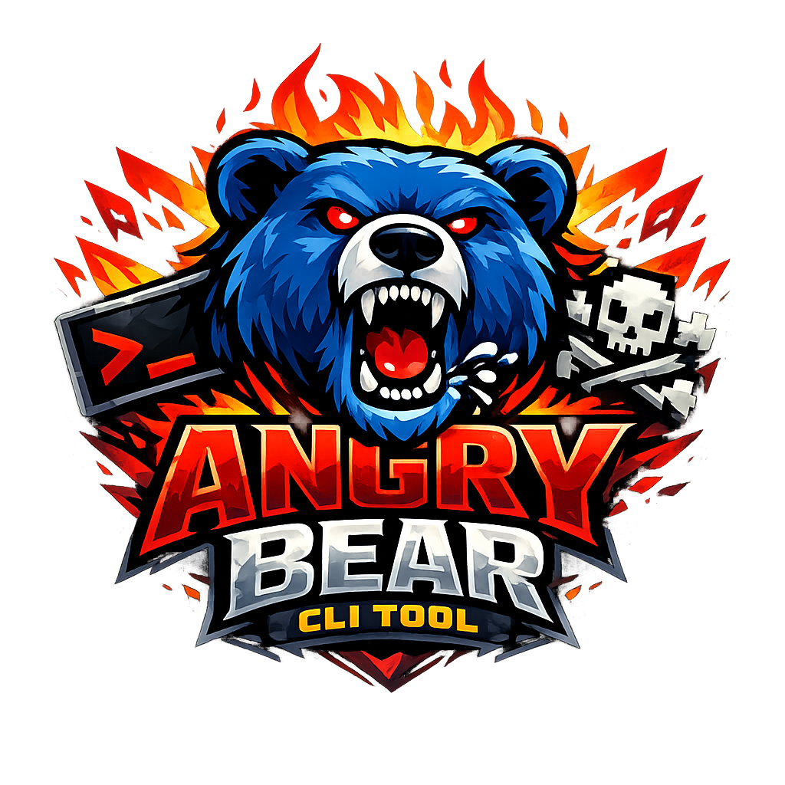

# angry-bear

<p align="center">
  
</p>

[](https://github.com/bluebear-io/angry-bear/actions/workflows/ci.yml)
[](https://github.com/bluebear-io/angry-bear)
[](LICENSE)

**Enforce skill-loading requirements for AI coding agents.**

angry-bear prevents AI coding agents (Claude Code, Cursor, and more) from modifying files until required skills have been loaded in the current session. It works as a pre-tool-use hook that checks enforcement rules and blocks operations when required skills are missing.

## Install

```bash
# Homebrew (recommended)
brew tap bluebear-io/angry-bear
brew trust bluebear-io/angry-bear   # Homebrew 6.0+ requires trusting third-party taps (one-time)
brew install angry-bear

# Go (requires $GOPATH/bin on your PATH)
go install github.com/bluebear-io/angry-bear/cmd/angry-bear@latest

# From source
git clone https://github.com/bluebear-io/angry-bear.git
cd angry-bear && make install
# Binary installed to $GOPATH/bin — ensure it's on your PATH:
# export PATH="$HOME/go/bin:$PATH"  # add to ~/.zshrc or ~/.bashrc
```

## Quick Start

```bash
cd your-project
angry-bear add go-standards --tool Edit,Write --path "**/*.go"
# ✓ Hooks installed for claude
# ✓ Hooks installed for cursor
# Added 2 rules for skill "go-standards"
```

Hooks auto-install on first use. When an agent tries to edit a Go file without loading `go-standards`:

```
Blocked by angry-bear skill enforcement.
Required skills not loaded: "go-standards".
Load them by running: /go-standards
```

The agent loads the skill, retries, and succeeds.

## CLI Reference

### `angry-bear add` — Add enforcement rules

```bash
angry-bear add                    # Interactive mode — pick skill, tools, paths, agents
angry-bear add <skill> [flags]    # One-liner — cartesian product of tools × paths × agents
```

| Flag | Default | Description |
|------|---------|-------------|
| `--tool` | `*` | Comma-separated: `Edit`, `Write`, `Bash`, `Read`, `Glob`, `Grep`, `Agent`, `*` |
| `--path` | `**` | Comma-separated glob patterns |
| `--agent` | `*` | `claude`, `cursor`, `*` (all) |
| `--repo` | `false` | Save to `{project}/.angry-bear/` (shared via git) instead of machine config |

```bash
angry-bear add sst-architect --tool Edit,Write --path "stacks/**"
angry-bear add linear                                            # all tools, all paths
angry-bear add testing --path "**/*_test.go,**/test_*.py"        # multiple patterns
angry-bear add go-standards --tool Edit --path "**/*.go" --repo  # shared with team via git
```

### `angry-bear rules` — List rules

```bash
angry-bear rules                    # table format with [repo]/[machine] source labels
angry-bear rules --skill linear     # filter by skill
angry-bear rules --json             # JSON for scripting
```

Rules from both repo-level (`{project}/.angry-bear/`) and machine-level (`~/.angry-bear/repos/`) sources are merged and displayed with their origin.

### `angry-bear rm` — Remove rules

```bash
angry-bear rm <skill>                           # all rules for a skill
angry-bear rm go-standards --tool Bash           # specific matches only
angry-bear rm testing --path "**/*_test.go"
angry-bear rm go-standards --repo               # remove from repo config (shared via git)
```

### `angry-bear enable` / `disable` — Hook management

```bash
angry-bear enable     # Install hooks into Claude + Cursor configs
angry-bear disable    # Remove ALL angry-bear hooks (stops enforcement)
```

Rules are preserved when disabled. `enable` re-activates.

### `angry-bear status` — Project overview

Shows enforcement rules, active sessions with loaded skills, discovered skill definitions, and detected agent integrations.

### `angry-bear doctor` — Health check

Checks config validity, hook installation, state directory, binary on PATH, and skill paths. Each failure includes a fix hint.

### `angry-bear clean` — Session cleanup

```bash
angry-bear clean                    # remove expired sessions (TTL-based)
angry-bear clean --all              # remove ALL sessions
angry-bear clean --session <id>     # remove specific session
```

### `angry-bear version`

```bash
angry-bear version
# angry-bear version v0.9.0 (commit: 7b7af12, built: 2026-04-16T10:38:11Z)
```

### `angry-bear completion` — Shell completions

```bash
angry-bear completion zsh > "${fpath[1]}/_angry-bear"     # Zsh
angry-bear completion bash > /etc/bash_completion.d/angry-bear  # Bash
angry-bear completion fish > ~/.config/fish/completions/angry-bear.fish  # Fish
```

Tab-completes skill names, tool names, and agent names.

### Global Flags

| Flag | Description |
|------|-------------|
| `--config <path>` | Override config file path |
| `--verbose` | Debug logging to stderr |

## Interactive TUI

```bash
angry-bear    # launches the TUI
```

### Dashboard Keys

| Key | Action |
|-----|--------|
| `↑↓` | Navigate within panel |
| `Tab` / `Shift+Tab` | Cycle panels: skills → rules → logs |
| `←→` | Switch panels |
| `Enter` / `a` | Add rules for selected skill |
| `t` | Cycle tool on selected rule |
| `p` | Edit path inline |
| `g` | Cycle agent on selected rule |
| `d` | Delete selected rule |
| `y` | Duplicate selected rule |
| `s` | Save to disk |
| `c` | Settings page |
| `P` | Switch project |
| `q` | Quit |

### Event Log Keys

| Key | Action |
|-----|--------|
| `f` | Filter mode (`←→` select column, `↑↓` cycle values) |
| `Esc` | Clear all filters |
| `PgUp/Dn` | Page through logs |
| `Home/End` | Jump to top/bottom |
| `Enter` | Jump to skill that caused event |

### Rule Editor Keys

| Key | Action |
|-----|--------|
| `↑↓` | Navigate within section |
| `Tab` | Next section (TOOLS → PATHS → AGENTS) |
| `Space` | Toggle selection |
| `→` / `Enter` | Expand directory |
| `←` | Collapse / parent |
| `s` | Save |
| `Esc` | Cancel |

### Settings Keys

| Key | Action |
|-----|--------|
| `↑↓` | Navigate |
| `←→` | Cycle values (checkout path) |
| `Enter` | Edit value |
| `g` / `p` | Switch global / project config |
| `Esc` | Save and exit |

## How It Works

```
AI Agent (Claude Code / Cursor)
    |
    | PreToolUse event (JSON via stdin)
    v
angry-bear hook
    |
    +-- Parse input (adapter normalizes agent-specific format)
    +-- Check skill invocation → record in session state
    +-- Load enforcement rules
    +-- Load session state (check loaded skills + TTL)
    +-- Evaluate: ShouldBlock(rules, tool, path, agent, skills)
    |
    +-- Allowed → agent proceeds
    +-- Blocked → "Load skill by running: /skill-name"
```

### Rule Sources: Repo vs Machine

Rules can live in two places:

| Source | Location | Shared? |
|--------|----------|---------|
| **Repo** | `{project}/.angry-bear/skill_enforcement.json` | Yes — committed to git, shared with team |
| **Machine** | `~/.angry-bear/repos/{hash}/skill_enforcement.json` | No — local to this machine |

Use `--repo` with `add` and `rm` to manage repo-level rules. Repo rules take precedence when both sources define the same rule.

### Data Storage

```
{project}/.angry-bear/                # repo-level (committed to git)
  skill_enforcement.json              #   shared enforcement rules

~/.angry-bear/                        # machine-level (local only)
  config.json                         # global defaults
  events.log                          # enforcement log
  repos/{hash}-{slug}/                # per-repo
    skill_enforcement.json            #   machine-only rules
    config.json                       #   config overrides
    state/{session}.json              #   loaded skills
    preferences.json                  #   preferred checkout
```

See [docs/HIGHLEVEL.md](docs/HIGHLEVEL.md) for the complete architecture.

## Configuration

### `skill_enforcement.json`

```json
{
  "version": 1,
  "tools": [
    { "tool": "Edit", "path": "**/*.go", "skill": "go-standards", "agent": "*" }
  ]
}
```

### `config.json`

| Field | Default | Description |
|-------|---------|-------------|
| `skill_paths` | `[".claude/skills"]` | Dirs to scan for skills |
| `skill_ttl_minutes` | `0` | Skill expiry (0 = never) |
| `state_ttl_hours` | `24` | Session state retention |
| `default_agent` | `*` | Default agent for new rules |

## Supported Agents

| Agent | Hook Config | Deny Format |
|-------|------------|-------------|
| Claude Code | `~/.claude/settings.json` | Exit 0 + JSON |
| Cursor | `~/.cursor/hooks.json` | Exit 2 + JSON |
| Custom | Implement `HookAdapter` | Your format |

## Troubleshooting

### `angry-bear: command not found`

```bash
export PATH="$HOME/go/bin:$PATH"  # add to ~/.zshrc
```

### Hook not firing?

```bash
angry-bear doctor        # check "Hook installed" lines
angry-bear enable        # reinstall hooks
```

Check `~/.claude/settings.json` → `hooks.PreToolUse` for a angry-bear entry. Note: `settings.local.json` permission entries are NOT hooks.

### Rules not showing?

Run from within the project directory (needs `.git/` to identify the repo).

### Agent blocked but shouldn't be?

```bash
angry-bear status        # check loaded skills
angry-bear clean --all   # reset sessions
```

## Contributing

See [CONTRIBUTING.md](CONTRIBUTING.md). All CI checks must pass, 80% minimum coverage.

## License

MIT — Copyright (c) Blue Bear Security. See [LICENSE](LICENSE).
